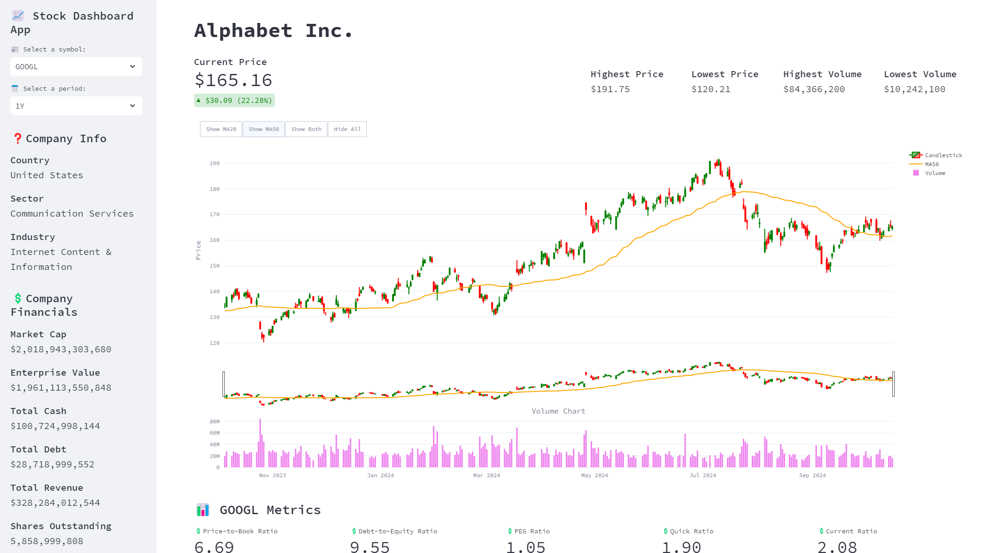
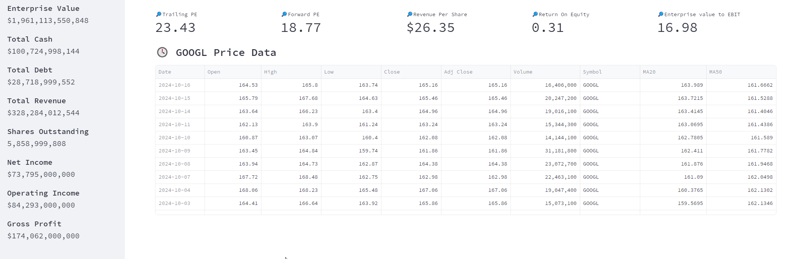

# Streamlit Stock Dashboard
 
A Streamlit application that leverages the yFinance API to fetch and visualize stock market data. The app displays key metrics such as price, volume, and moving averages. It features a user-friendly sidebar for selecting the stock symbol, date range, and moving average period.

[Try it out here!](https://app-stock-dashboard-rcf3kwydlx5knj9njeumpz.streamlit.app)

**Key Features:**
- Fetches real-time stock data using the yFinance API.
- Visualizes stock price, volume, and moving averages.
- Interactive sidebar for user input:
    - Select stock symbol.
    - Choose date range.
    - Set moving average period.


## Data Scraping and Preparation

The application begins by scraping the list of S&P 500 companies from Wikipedia. This is done using the `pandas` library to read the HTML table from the Wikipedia page and save it as a CSV file. The list of stock symbols is then extracted and prepared for further data retrieval.

```python
import pandas as pd
import yfinance as yf
import numpy as np
import time as time
from datetime import datetime

# Getting today's date and date from 5 years ago
now = datetime.today().strftime('%Y-%m-%d')
fiveyrsago = datetime.today() - pd.DateOffset(years=5)
fiveyrsago = fiveyrsago.strftime('%Y-%m-%d')

# Get the stock symbols from Wikipedia S&P 500 List
sp500link = "https://en.wikipedia.org/wiki/List_of_S%26P_500_companies#S&P_500_component_stocks"
tickers = pd.read_html(sp500link, header=0)[0]
tickers.to_csv("Streamlit-Stock-Dashboard/tickers_list.csv", index=False)
# Making the Symbol column into a list to later iterate through.
trackers = tickers['Symbol'].tolist()
print("S&P500 data scraped.")
```
### Explanation

#### Importing Libraries:
- Imports necessary libraries for data manipulation (`pandas`), financial data retrieval (`yfinance`), numerical operations (`numpy`), and date/time handling (`datetime`).

#### Getting Today's Date and Date from 5 Years Ago:
- `now` stores today's date in the format `YYYY-MM-DD`.
- `fiveyrsago` stores the date from 5 years ago in the same format.

#### Scraping S&P 500 Stock Symbols from Wikipedia:
- `sp500link` stores the URL of the Wikipedia page containing the list of S&P 500 companies.
- `tickers` uses `pandas` to read the HTML table from the Wikipedia page and stores it as a DataFrame.
- The DataFrame is then saved to a CSV file named `tickers_list.csv` in the `Streamlit-Stock-Dashboard` directory.

#### Preparing the List of Stock Symbols:
- Extracts the `Symbol` column from the DataFrame and converts it into a list named `trackers`.
- Prints a message indicating that the S&P 500 data has been successfully scraped.

This code ensures that the application has the most up-to-date list of S&P 500 companies, which is essential for retrieving accurate financial data.

## yFinance API Functions

### Function: `get_stat_data`

The `get_stat_data` function retrieves valuation data for a list of stock symbols using the yFinance API and saves the data to a CSV file.

#### Parameters:
- `trackers` (list): A list of stock symbols to retrieve data for.

#### Process:
1. Initializes an empty list `valuations` to store the valuation data.
2. Iterates over each stock symbol in the `trackers` list:
   - Replaces any periods in the symbol with hyphens to match yFinance's format.
   - Uses the yFinance `Ticker` object to retrieve the stock's valuation data.
   - Adds the stock symbol to the valuation data.
   - Appends the valuation data to the `valuations` list.
   - Prints a success message if the data is downloaded successfully.
   - Prints an error message if the data download fails.
3. Concatenates the `valuations` list into a DataFrame.
4. Saves the DataFrame to a CSV file named `valuations_data.csv` in the `Streamlit-Stock-Dashboard` directory.
5. Prints a message indicating that the valuations data has been saved to the CSV file.

#### Code:
```python
def get_stat_data(trackers):
    valuations = []
    
    for tracker in trackers:
        try:
            tracker = tracker.replace(".", "-")
            ticker = yf.Ticker(tracker)
            valuation = ticker.info
            valuation['Symbol'] = tracker
            valuations.append(valuation)
            print(f"{tracker} data downloaded.")
            
        except Exception as e:
            print(f"{tracker} data FAILED to download.")
            print(e)
    
    # Concatenate valuations data into a DataFrame
    final_valuations = pd.DataFrame(valuations)
    final_valuations.to_csv("Streamlit-Stock-Dashboard/valuations_data.csv", index=False)
    print("Valuations data saved to CSV.")
```
### Function: `get_candlestick_data`

The `get_candlestick_data` function retrieves historical candlestick data for a list of stock symbols using the yFinance API and saves the data to a CSV file.

#### Parameters:
- `trackers` (list): A list of stock symbols to retrieve data for.
- `period` (str): The period over which to retrieve the data (e.g., '1mo', '3mo', '1y').
- `interval` (str): The interval at which to retrieve the data (e.g., '1d', '1wk', '1mo').

#### Process:
1. Initializes an empty list `candlestick_data` to store the historical data.
2. Iterates over each stock symbol in the `trackers` list:
   - Replaces any periods in the symbol with hyphens to match yFinance's format.
   - Uses the yFinance `Ticker` object to retrieve the stock's historical data for the specified period and interval.
   - Adds the stock symbol to the historical data.
   - Appends the historical data to the `candlestick_data` list.
   - Prints a success message if the data is downloaded successfully.
   - Prints an error message if the data download fails.
3. Concatenates the `candlestick_data` list into a DataFrame.
4. Saves the DataFrame to a CSV file named `candlestick_data.csv` in the `Streamlit-Stock-Dashboard` directory.
5. Prints a message indicating that the candlestick data has been saved to the CSV file.

#### Example Usage:
```python
def get_candlestick_data(trackers):
    candle_data = []
    financial_data = []
    
    for tracker in trackers:
        try:
            tracker = tracker.replace(".", "-")
            data = yf.download(tracker, start=fiveyrsago, end=now)
            data['Symbol'] = tracker
            candle_data.append(data)
            print(f"{tracker} candlestick data downloaded.")
            
            # Download financial data
            ticker = yf.Ticker(tracker)
            financials = ticker.financials.T
            financials['Symbol'] = tracker
            financial_data.append(financials)
            print(f"{tracker} financial data downloaded.")
            
        except Exception as e:
            print(f"{tracker} data FAILED to download.")
            print(e)
            
    # Concatenate candlestick data into a csv file
    final_candle_data = pd.concat(candle_data)
    final_candle_data.to_csv("Streamlit-Stock-Dashboard/candle_data.csv")
    print("Candlestick data saved to CSV.")
    
    # Concatenate financial data into a csv file
    final_financial_data = pd.concat(financial_data)
    final_financial_data.to_csv("Streamlit-Stock-Dashboard/financial_data.csv")
    print("Financial data saved to CSV.")
```
## Streamlit Application

### Code Overview

This section of the code sets up the environment for a stock dashboard using Streamlit and Plotly, and loads necessary data from CSV files.

#### Libraries Imported:
- `pandas`: For data manipulation and analysis.
- `streamlit`: For creating the web application.
- `plotly.graph_objects` and `plotly.subplots`: For creating interactive plots.
- `itertools.islice`: For slicing iterators.

#### Key Steps:
1. **Page Configuration**:
   - Sets the page title to "Stocks Dashboard".
   - Sets the page icon to a stock chart emoji.
   - Configures the layout to be wide.

2. **Loading Data**:
   - Loads candlestick data from `data/candle_data.csv`.
   - Loads a list of stock tickers from `data/tickers_list.csv`.
   - Loads financial data from `data/financial_data.csv`.
   - Loads valuation data from `data/valuations_data.csv`.

3. **Getting Symbols**:
   - Extracts unique stock symbols from the candlestick data.
   - Converts the symbols to a list.

4. **Mapping Period to Number of Days**:
   - Creates a dictionary to map period strings (e.g., "1D", "1M") to the corresponding number of trading days.

#### Code:
```python
import pandas as pd
import streamlit as st
import plotly.graph_objects as go
import plotly.io as pio
from itertools import islice
from plotly.subplots import make_subplots

# Setting the page configuration
st.set_page_config(page_title="Stocks Dashboard", page_icon="💹", layout = "wide")

# Loading the data
data = pd.read_csv("data/candle_data.csv")
tickers = pd.read_csv("data/tickers_list.csv")
financial = pd.read_csv("data/financial_data.csv")
valuations = pd.read_csv("data/valuations_data.csv")

# Getting the symbols
symbols = data['Symbol'].unique()
symbols = symbols.tolist()

# Mapping period to number of days
mapping_period = {"1D": 1, "1M": 21, "3M": 64, "6M": 128, "1Y": 260, "2Y": 518, "5Y": 1296}
```
### Function: `header`

The `header` function displays the header section of the dashboard, including the title of the selected stock.

#### Parameters:
- `valuations` (DataFrame): A DataFrame containing valuation data for various stocks.
- `selected_data` (DataFrame): A DataFrame containing data for the selected stock.

#### Process:
1. Filters the `valuations` DataFrame to get the valuation data for the selected stock symbol.
2. Sets the title of the Streamlit app to the `longName` of the selected stock.

#### Code:
```python
def header(valuations, selected_data):
    selected_valuation = valuations[valuations['Symbol'] == selected_data['Symbol'].iloc[0]]
    st.title(f"{selected_valuation['longName'].iloc[0]}")
```

### Functions: `custom_metric` and `custom_metric_two`

These functions define the style of the metrics displayed on the dashboard using custom HTML and CSS.

#### Function: `custom_metric`

Displays a metric with a custom style.

##### Parameters:
- `label` (str): The label for the metric.
- `value` (str): The value of the metric.

##### Process:
1. Uses `st.markdown` to render HTML with custom styling for the metric.
2. The HTML includes a `div` with a specific font size, margin, and padding.

##### Code:
```python
def custom_metric(label, value):
    st.markdown(
        f"""
        <div style="font-size: 20px; margin-bottom: 8px; padding-bottom: 10px;">
            <strong>{label}</strong><br>
            {value}
        </div>
        """,
        unsafe_allow_html=True
    )
```
### Function: `display_metrics`

The `display_metrics` function displays various financial and company information metrics in the sidebar of the Streamlit dashboard.

#### Parameters:
- `selected_data` (DataFrame): A DataFrame containing data for the selected stock.
- `financial` (DataFrame): A DataFrame containing financial data for various stocks.
- `valuations` (DataFrame): A DataFrame containing valuation data for various stocks.

#### Process:
1. Uses the Streamlit sidebar to create a single column for metrics.
2. Filters the `valuations` and `financial` DataFrames to get data for the selected stock symbol.
3. Displays company information metrics in the sidebar:
   - Country
   - Sector
   - Industry
4. Displays company financial metrics in the sidebar:
   - Market Cap
   - Enterprise Value
   - Total Cash
   - Total Debt
   - Total Revenue
   - Shares Outstanding
   - Net Income
   - Operating Income
   - Gross Profit

#### Example Usage:
```python
def display_metrics(selected_data, financial, valuations):
    with st.sidebar:
        # Create a single column for metrics
        col = st
        selected_valuation = valuations[valuations['Symbol'] == selected_data['Symbol'].iloc[0]]
        selected_financial = financial[financial['Symbol'] == selected_data['Symbol'].iloc[0]]
    
        # Display statistics in the sidebar
        st.title("❓Company Info")
        custom_metric("Country", selected_valuation['country'].iloc[0])
        custom_metric("Sector", selected_valuation['sector'].iloc[0])
        custom_metric("Industry", selected_valuation['industryDisp'].iloc[0])
        
        st.title("💲Company Financials")
        custom_metric("Market Cap", f"${selected_valuation['marketCap'].iloc[0]:,.0f}")
        custom_metric("Enterprise Value", f"${selected_valuation['enterpriseValue'].iloc[0]:,.0f}")
        custom_metric("Total Cash", f"${selected_valuation['totalCash'].iloc[0]:,.0f}")
        custom_metric("Total Debt", f"${selected_valuation['totalDebt'].iloc[0]:,.0f}")
        custom_metric("Total Revenue", f"${selected_valuation['totalRevenue'].iloc[0]:,.0f}")
        custom_metric("Shares Outstanding", f"{selected_valuation['sharesOutstanding'].iloc[0]:,.0f}")
        custom_metric("Net Income", f"${selected_financial['Net Income'].iloc[0]:,.0f}")
        custom_metric("Operating Income", f"${selected_financial['Operating Income'].iloc[0]:,.0f}")
        custom_metric("Gross Profit", f"${selected_financial['Gross Profit'].iloc[0]:,.0f}")
```

### Function: `display_df`

The `display_df` function displays the price data of the selected stock for a specified period in a table format on the Streamlit dashboard.

#### Parameters:
- `selected_data` (DataFrame): A DataFrame containing historical price data for the selected stock.
- `selected_period` (str): The period over which to display the data (e.g., "1D", "1M").
- `selected_symbol` (str): The symbol of the selected stock.

#### Process:
1. Displays a subheader with the selected stock symbol and a description.
2. Filters the `selected_data` DataFrame to include only the rows corresponding to the selected period.
3. Resets the index of the filtered DataFrame.
4. Sorts the DataFrame by the 'Date' column in descending order.
5. Sets the 'Date' column as the index of the DataFrame.
6. Displays the DataFrame in a table format using Streamlit's `st.dataframe` function with container width enabled.

#### Code:
```python
def display_df(selected_data, selected_period, selected_symbol):
    st.subheader(f"**🕓 {selected_symbol} Price Data**")
    with st.container():
        selected_data = selected_data.iloc[-mapping_period[selected_period]:]
        selected_data = selected_data.reset_index(drop=True)  
        selected_data = selected_data.sort_values(by='Date', ascending=False)
        selected_data = selected_data.set_index('Date')  
        
        st.dataframe(selected_data, use_container_width=True)
```
### Function: `display_metrics`

The `display_metrics` function displays various financial and company information metrics in the sidebar of the Streamlit dashboard.

#### Parameters:
- `selected_data` (DataFrame): A DataFrame containing data for the selected stock.
- `financial` (DataFrame): A DataFrame containing financial data for various stocks.
- `valuations` (DataFrame): A DataFrame containing valuation data for various stocks.

#### Process:
1. Uses the Streamlit sidebar to create a single column for metrics.
2. Filters the `valuations` and `financial` DataFrames to get data for the selected stock symbol.
3. Displays company information metrics in the sidebar:
   - Country
   - Sector
   - Industry
4. Displays company financial metrics in the sidebar:
   - Market Cap
   - Enterprise Value
   - Total Cash
   - Total Debt
   - Total Revenue
   - Shares Outstanding
   - Net Income
   - Operating Income
   - Gross Profit

#### Code:
```python
def display_metrics(selected_data, financial, valuations):
    with st.sidebar:
        # Create a single column for metrics
        col = st
        selected_valuation = valuations[valuations['Symbol'] == selected_data['Symbol'].iloc[0]]
        selected_financial = financial[financial['Symbol'] == selected_data['Symbol'].iloc[0]]
    
        # Display statistics in the sidebar
        st.title("❓Company Info")
        custom_metric("Country", selected_valuation['country'].iloc[0])
        custom_metric("Sector", selected_valuation['sector'].iloc[0])
        custom_metric("Industry", selected_valuation['industryDisp'].iloc[0])
        
        st.title("💲Company Financials")
        custom_metric("Market Cap", f"${selected_valuation['marketCap'].iloc[0]:,.0f}")
        custom_metric("Enterprise Value", f"${selected_valuation['enterpriseValue'].iloc[0]:,.0f}")
        custom_metric("Total Cash", f"${selected_valuation['totalCash'].iloc[0]:,.0f}")
        custom_metric("Total Debt", f"${selected_valuation['totalDebt'].iloc[0]:,.0f}")
        custom_metric("Total Revenue", f"${selected_valuation['totalRevenue'].iloc[0]:,.0f}")
        custom_metric("Shares Outstanding", f"{selected_valuation['sharesOutstanding'].iloc[0]:,.0f}")
        custom_metric("Net Income", f"${selected_financial['Net Income'].iloc[0]:,.0f}")
        custom_metric("Operating Income", f"${selected_financial['Operating Income'].iloc[0]:,.0f}")
        custom_metric("Gross Profit", f"${selected_financial['Gross Profit'].iloc[0]:,.0f}")
```
### Function: `display_chart`

The `display_chart` function visualizes financial data using Streamlit and Plotly. It includes candlestick charts, moving averages, and volume charts.

#### Parameters:
- `selected_data` (DataFrame): A DataFrame containing data for the selected stock.
- `selected_period` (str): A string representing the selected period for slicing the data.
- `financial` (DataFrame): A DataFrame containing financial data for various stocks.

#### Process:
1. **Calculate Moving Averages**:
   - Computes 20-day (`MA20`) and 50-day (`MA50`) moving averages for the `Close` prices.

2. **Slice Data**:
   - Slices the dataset based on the selected period.
   - Resets the index of the sliced data.
   - Filters the financial data for the symbol present in the selected data.

3. **Create Subplots**:
   - Creates subplots with shared x-axis for the candlestick chart and volume chart.

4. **Add Traces**:
   - Adds a candlestick chart to the first row.
   - Adds moving averages (`MA20` and `MA50`) to the first row.
   - Adds a volume bar chart to the second row.

5. **Update Layout**:
   - Updates the layout with buttons to toggle the visibility of moving averages.
   - Configures layout properties such as axis titles, height, and margins.

6. **Display Chart**:
   - Uses `st.plotly_chart` to render the chart in Streamlit.

#### Code:
```python
def display_chart(selected_data, selected_period, financial):
    with st.container():
        # Calculate moving averages on the entire dataset
        selected_data['MA20'] = selected_data['Close'].rolling(window=20).mean()
        selected_data['MA50'] = selected_data['Close'].rolling(window=50).mean()

        # Slice the dataset based on the selected period
        selected_data = selected_data.iloc[-mapping_period[selected_period]:]
        selected_data = selected_data.reset_index()  
        financial = financial[financial['Symbol'] == selected_data['Symbol'].iloc[0]]

        # Create subplots with shared x-axis
        fig = make_subplots(rows=2, cols=1, shared_xaxes=True, 
                            row_heights=[0.8, 0.2], vertical_spacing=0.2,
                            subplot_titles=('', 'Volume Chart'))

        # Add candlestick chart to the first row
        fig.add_trace(go.Candlestick(
            x=selected_data['Date'],
            open=selected_data['Open'],
            high=selected_data['High'],
            low=selected_data['Low'],
            close=selected_data['Close'],
            name='Candlestick',
            increasing_line_color='green',  
            decreasing_line_color='red'    
        ), row=1, col=1)

        # Add moving averages to the first row
        fig.add_trace(go.Scatter(x=selected_data['Date'], y=selected_data['MA20'], mode='lines', name='MA20', line_shape='spline', line=dict(color='light blue')), row=1, col=1)
        fig.add_trace(go.Scatter(x=selected_data['Date'], y=selected_data['MA50'], mode='lines', name='MA50', line_shape='spline', line=dict(color='orange')), row=1, col=1)

        # Add volume bar chart to the second row
        fig.add_trace(go.Bar(x=selected_data['Date'], y=selected_data['Volume'], name='Volume', marker_color='violet'), row=2, col=1)

        # Set the layout properties
        fig.update_layout(
            xaxis_title='',  
            yaxis_title='Price',
            height=800,
            margin=dict(t=50, b=50),  
            updatemenus=[{
                'type': 'buttons',
                'buttons': [
                    {
                        'label': 'Show MA20',
                        'method': 'update',
                        'args': [{'visible': [True, True, False, True]}]
                    },
                    {
                        'label': 'Show MA50',
                        'method': 'update',
                        'args': [{'visible': [True, False, True, True]}]
                    },
                    {
                        'label': 'Show Both',
                        'method': 'update',
                        'args': [{'visible': [True, True, True, True]}]
                    },
                    {
                        'label': 'Hide All',
                        'method': 'update',
                        'args': [{'visible': [True, False, False, True]}]
                    }
                ],
                'direction': 'left',
                'pad': {'r': 10, 't': 10},
                'showactive': True,
                'x': -0.036,
                'xanchor': 'left',
                'y': 1.1,
                'yanchor': 'top'
            }]
        )

        st.plotly_chart(fig)
```

### Function: `display_financials`

The `display_financials` function displays various financial metrics for a selected stock symbol using Streamlit.

#### Parameters:
- `selected_data` (DataFrame): A DataFrame containing data for the selected stock.
- `valuations` (DataFrame): A DataFrame containing valuation data for various stocks.

#### Process:
1. Creates a container in the Streamlit app to display the metrics.
2. Filters the `valuations` DataFrame to get data for the selected stock symbol.
3. Displays a subheader with the stock symbol.
4. Defines a list of financial metrics to display:
   - Price-to-Book Ratio
   - Debt-to-Equity Ratio
   - PEG Ratio
   - Quick Ratio
   - Current Ratio
   - Trailing PE
   - Forward PE
   - Revenue Per Share
   - Return On Equity
   - Enterprise value to EBIT
5. Creates columns in the Streamlit app to display the metrics.
6. Iterates over the metrics and displays each one in the appropriate column.

#### Code:
```python
def display_financials(selected_data, valuations):
    with st.container():
        selected_valuation = valuations[valuations['Symbol'] == selected_data['Symbol'].iloc[0]]
        st.subheader(f"📊 {selected_data['Symbol'].iloc[0]} Metrics")
        metrics = [
            ("💲Price-to-Book Ratio", f"{selected_valuation['priceToBook'].iloc[0]:.2f}"),
            ("💲Debt-to-Equity Ratio", f"{selected_valuation['debtToEquity'].iloc[0]:.2f}"),
            ("💲PEG Ratio", f"{selected_valuation['pegRatio'].iloc[0]:.2f}"),
            ("💲Quick Ratio", f"{selected_valuation['quickRatio'].iloc[0]:.2f}"),
            ("💲Current Ratio", f"{selected_valuation['currentRatio'].iloc[0]:.2f}"),
            ("🔎Trailing PE", f"{selected_valuation['trailingPE'].iloc[0]:.2f}"),
            ("🔎Forward PE", f"{selected_valuation['forwardPE'].iloc[0]:.2f}"),
            ("🔎Revenue Per Share", f"${selected_valuation['revenuePerShare'].iloc[0]:.2f}"),
            ("🔎Return On Equity", f"{selected_valuation['returnOnEquity'].iloc[0]:.2f}"),
            ("🔎Enterprise value to EBIT", f"{selected_valuation['enterpriseToEbitda'].iloc[0]:.2f}"),
        ]
        
        cols = st.columns(5)
        for i, (label, value) in enumerate(metrics):
            col = cols[i % 5]
            col.metric(label, value)
```
## Final Pictures


